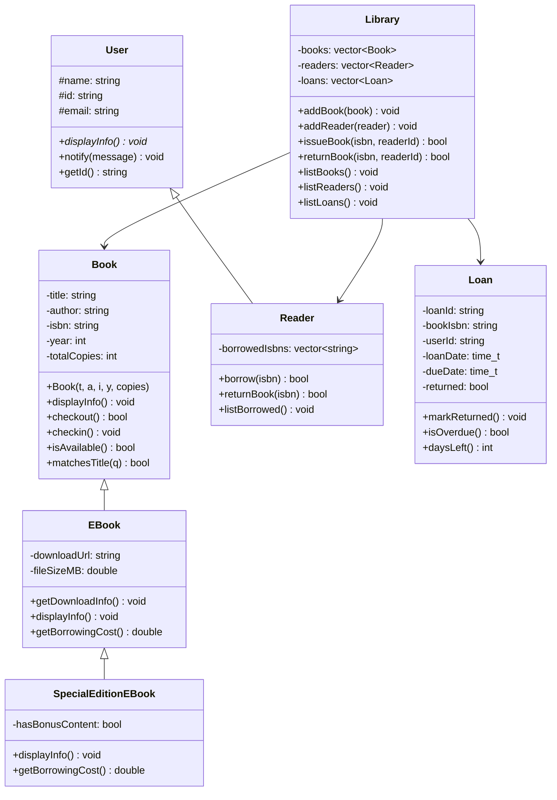
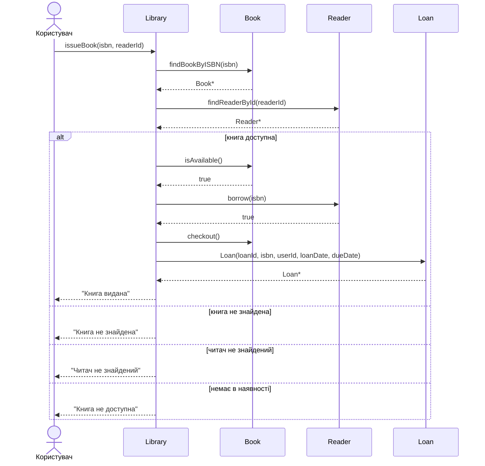
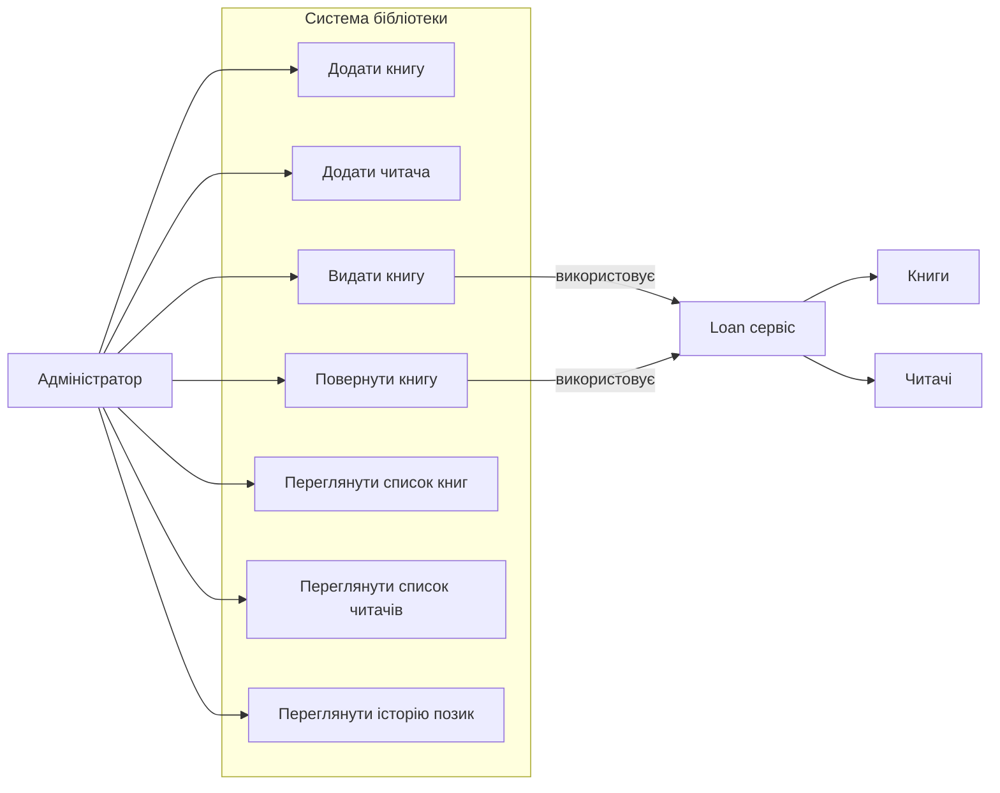
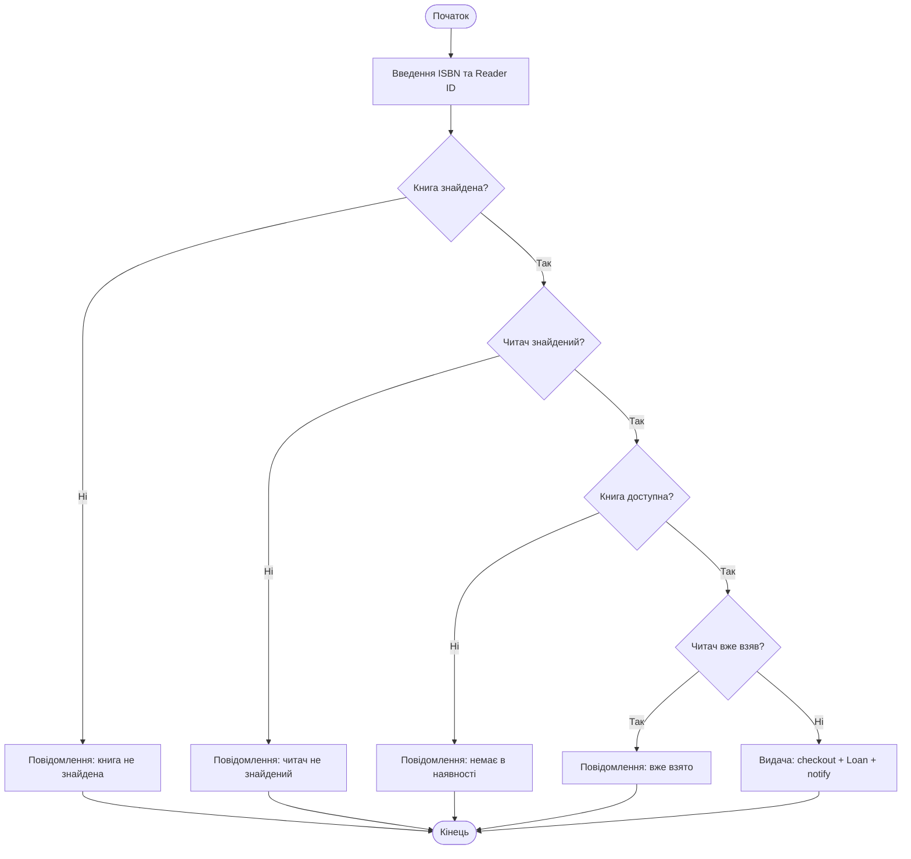
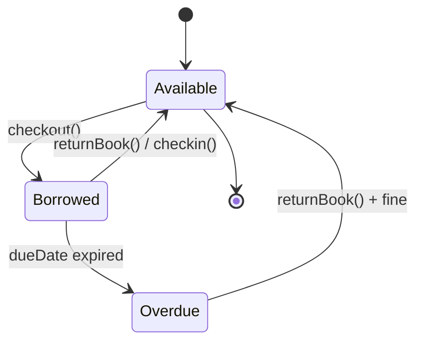
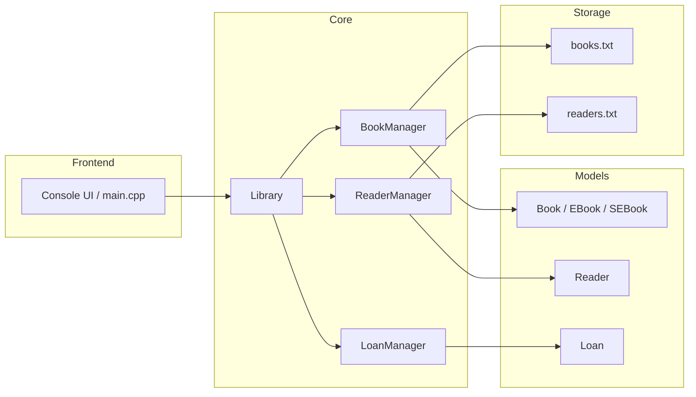
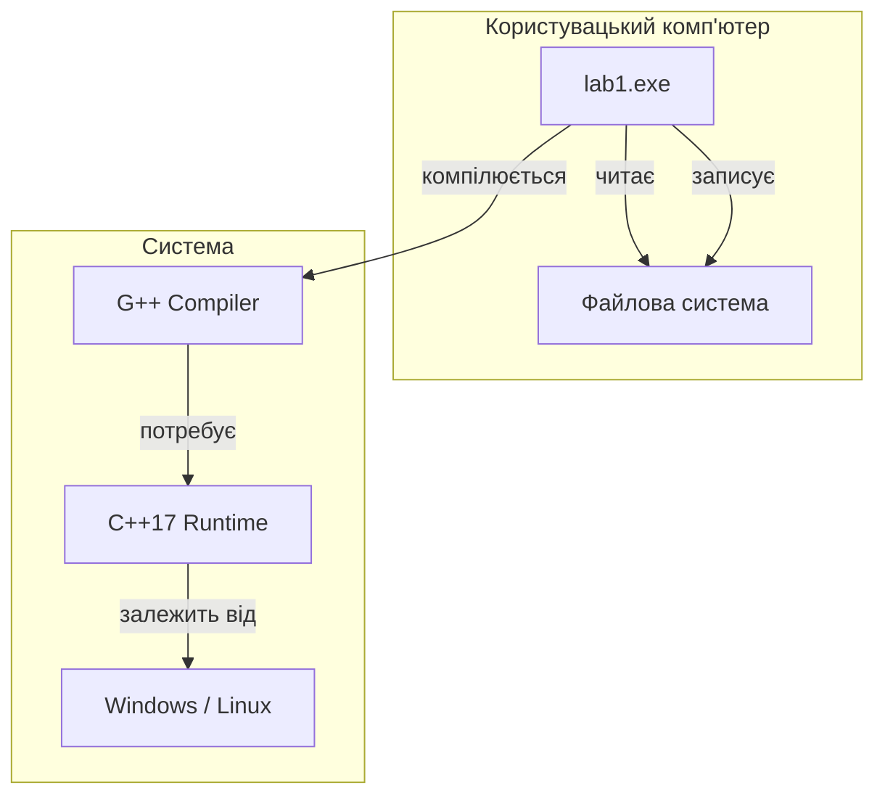
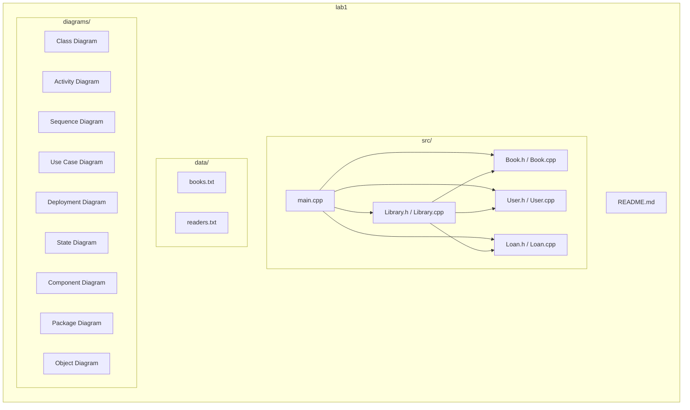
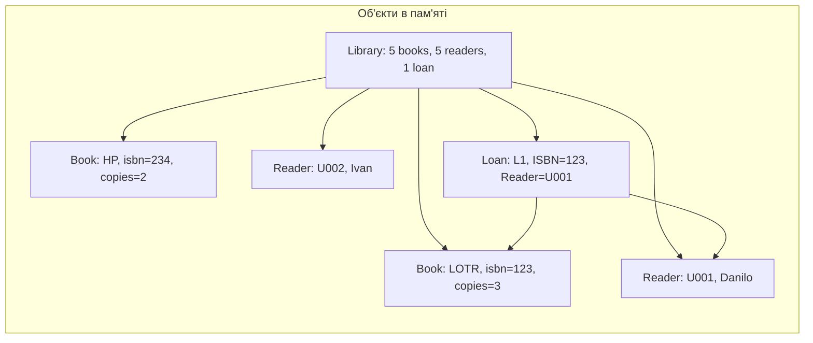

# Лабораторна робота №1 — Бібліотека (C++, ООП)

Система керування бібліотекою з використанням класів, наслідування, поліморфізму та роботи з файлами.

## Все типи UML-діаграм

### 1. Діаграма класів (Class Diagram)



### 2. Діаграма послідовності (Sequence Diagram)



### 3. Діаграма варіантів використання (Use Case Diagram)



### 4. Діаграма активності (Activity Diagram)



### 5. Діаграма станів (State Diagram)



### 6. Діаграма компонент (Component Diagram)



### 7. Діаграма розгортання (Deployment Diagram)



### 8. Діаграма пакетів (Package Diagram)



### 9. Діаграма об'єктів (Object Diagram)



## Складання

```bash
g++ -std=c++17 main.cpp Book.cpp User.cpp Loan.cpp Library.cpp -o lab1
```

## Формат файлів

**books.txt**
```
Title;Author;ISBN;Year;Copies
The Lord of the Rings;J.R.R. Tolkien;1234567890;1954;3
```

**readers.txt**
```
Name;Id;Email
Danilo;U001;danilo@example.com
```

## Використання

```bash
./lab1
```

Додаткові діаграми: див. папки `Class Diagram/`, `Sequence Diagram/`, `Activity Diagram/`, `Use Case/`.
